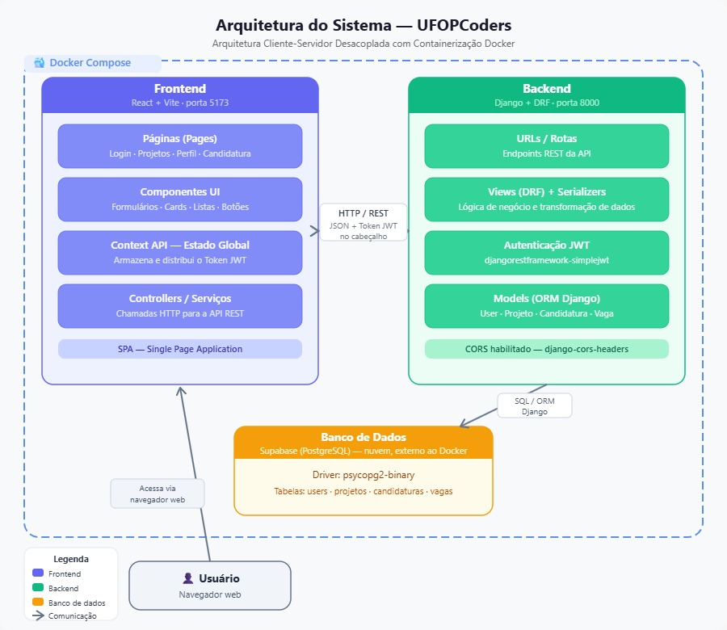

# Arquitetura do Sistema — UFOPCoders

> Arquitetura Cliente-Servidor Desacoplada com Containerização Docker

## Visão Geral

O sistema segue uma arquitetura desacoplada (decoupled), na qual o **Frontend** e o **Backend** são serviços independentes orquestrados via **Docker Compose**, comunicando-se através de uma API REST autenticada por JWT. O **Banco de Dados** roda fora do Docker, na nuvem (Supabase).

## Diagrama



## Estrutura em Árvore

```
UFOPCoders — Arquitetura do Sistema
│
├── 👤 Usuário
│   └── Navegador web
│
├── 🐳 Docker Compose
│   │
│   ├── 🟣 Frontend (React + Vite · porta 5173)
│   │   ├── Páginas (Pages)
│   │   │   └── Login · Projetos · Perfil · Candidatura
│   │   ├── Componentes UI
│   │   │   └── Formulários · Cards · Listas · Botões
│   │   ├── Context API — Estado Global
│   │   │   └── Armazena e distribui o Token JWT
│   │   ├── Controllers / Serviços
│   │   │   └── Chamadas HTTP para a API REST
│   │   └── SPA — Single Page Application
│   │
│   ├── 🔗 HTTP / REST
│   │   └── JSON + Token JWT no cabeçalho
│   │
│   └── 🟢 Backend (Django + DRF · porta 8000)
│       ├── URLs / Rotas
│       │   └── Endpoints REST da API
│       ├── Views (DRF) + Serializers
│       │   └── Lógica de negócio e transformação de dados
│       ├── Autenticação JWT
│       │   └── djangorestframework-simplejwt
│       ├── Models (ORM Django)
│       │   └── User · Projeto · Candidatura · Vaga
│       └── CORS habilitado — django-cors-headers
│
├── 🔗 SQL / ORM Django
│
└── 🟠 Banco de Dados (externo ao Docker)
    └── Supabase (PostgreSQL) — nuvem
        ├── Driver: psycopg2-binary
        └── Tabelas: users · projetos · candidaturas · vagas
```

## Componentes

### 🟣 Frontend — React + Vite (porta 5173)

| Camada | Responsabilidade |
|---|---|
| Páginas (Pages) | Login, Projetos, Perfil, Candidatura |
| Componentes UI | Formulários, Cards, Listas, Botões |
| Context API — Estado Global | Armazena e distribui o Token JWT |
| Controllers / Serviços | Chamadas HTTP para a API REST |
| SPA | Single Page Application |

### 🟢 Backend — Django + DRF (porta 8000)

| Camada | Responsabilidade |
|---|---|
| URLs / Rotas | Endpoints REST da API |
| Views (DRF) + Serializers | Lógica de negócio e transformação de dados |
| Autenticação JWT | `djangorestframework-simplejwt` |
| Models (ORM Django) | `User`, `Projeto`, `Candidatura`, `Vaga` |
| CORS | Habilitado via `django-cors-headers` |

### 🟠 Banco de Dados — Supabase (PostgreSQL)

- Hospedado na nuvem, **externo** ao ambiente Docker
- Driver de conexão: `psycopg2-binary`
- Tabelas: `users`, `projetos`, `candidaturas`, `vagas`

### 👤 Usuário

- Acessa o sistema via navegador web, consumindo o Frontend (SPA)

## Fluxo de Comunicação

1. **Usuário → Frontend**: acesso via navegador web
2. **Frontend ↔ Backend**: requisições HTTP/REST, payloads em JSON, autenticação via Token JWT no cabeçalho
3. **Backend ↔ Banco de Dados**: consultas via ORM Django (SQL) ao Supabase/PostgreSQL

## Stack Tecnológica

| Camada | Tecnologia |
|---|---|
| Frontend | React + Vite |
| Backend | Django + Django REST Framework (DRF) |
| Autenticação | JWT (djangorestframework-simplejwt) |
| Banco de Dados | Supabase (PostgreSQL) |
| Orquestração | Docker Compose |
| CORS | django-cors-headers |

## Legenda

- 🟣 **Frontend**
- 🟢 **Backend**
- 🟠 **Banco de Dados**
- 🔗 **Comunicação** (chamada entre serviços)