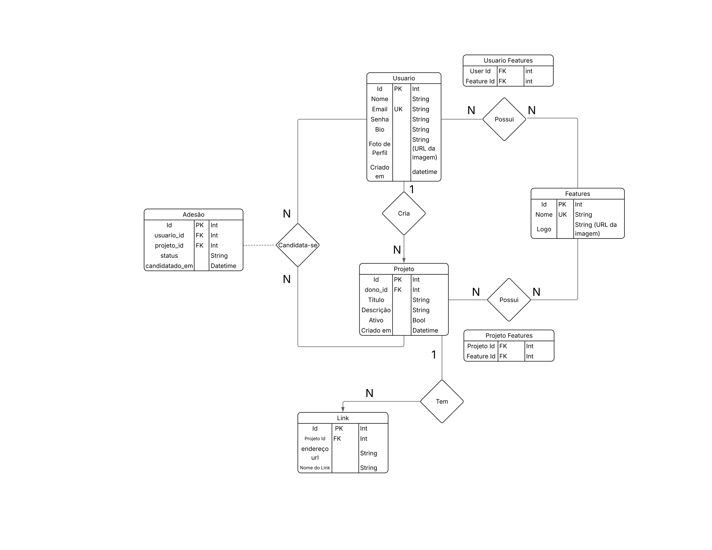

## Arquitetura do Banco de Dados (Principais Entidades)

### 1. `Usuario` 

Centraliza as informações cadastrais e de autenticação do usuário na plataforma.

* **Campos Críticos:**

`Id` (PK): Identificador único e sequencial do usuário.

`Email` (UK): Garante que não existam duas contas cadastradas com o mesmo e-mail.

`Senha`: Campo dimensionado para armazenar o *hash* criptográfico da senha.

`Foto de Perfil`: Armazena a URL da imagem para otimizar o banco.

### 2. `Projeto` 

Armazena os dados dos projetos criados na plataforma.

* **Campos Críticos:**

`dono_id` (FK): Chave estrangeira que aponta diretamente para o `Usuario` que criou o projeto (Relacionamento 1:N — Um usuário cria vários projetos).

`Ativo` (Bool): Flag que controla se o projeto ainda está aceitando candidaturas ou se já foi finalizado.

### 3. `Link` 

Permite que um projeto centralize múltiplos endereços externos (como repositórios do GitHub, Figma, ou sites de produção).

**Relacionamento (1:N):** Um projeto possui vários links.

**Campos Críticos:** `Projeto id` (FK) garante o vínculo exclusivo com seu projeto de origem.

## Tabelas Associativas 

O grande motor do sistema roda através de relacionamentos **N:N**, mapeados pelas seguintes tabelas de junção:

### A. Controle de Candidaturas: `Adesão`

Esta tabela gerencia o fluxo de entrada de usuários nos projetos. Diferente de uma junção simples, ela funciona como uma **Entidade Associativa** porque carrega o histórico e as regras de negócio da candidatura.

* **Campos Críticos:**

`usuario_id` (FK) e `projeto_id` (FK): Conectam o candidato ao projeto correspondente.

`status`: String que dita a fase da candidatura (ex: `'pendente'`, `'aprovado'`, `'recusado'`).

`candidatado_em`: Registra o momento exato em que o usuário demonstrou interesse na vaga.

### B. Matriz de Competências: `Usuario Features` & `Projeto Features`

O sistema utiliza uma entidade unificada chamada `Features` (competências/tecnologias, ex: *React*, *Python*, *UI/UX*)  para classificar tanto a oferta quanto a demanda de habilidades.

**`Usuario Features`:** Associa as habilidades que um **Usuário possui**. Permite criar filtros de busca para encontrar profissionais qualificados.

*Campos:* `User Id` (FK) + `Feature Id` (FK).

**`Projeto Features`:** Associa os requisitos tecnológicos que um **Projeto necessita**. Permite que o sistema recomende projetos para os usuários com base no fit técnico deles.

*Campos:* `Projeto Id` (FK) + `Feature Id` (FK).

